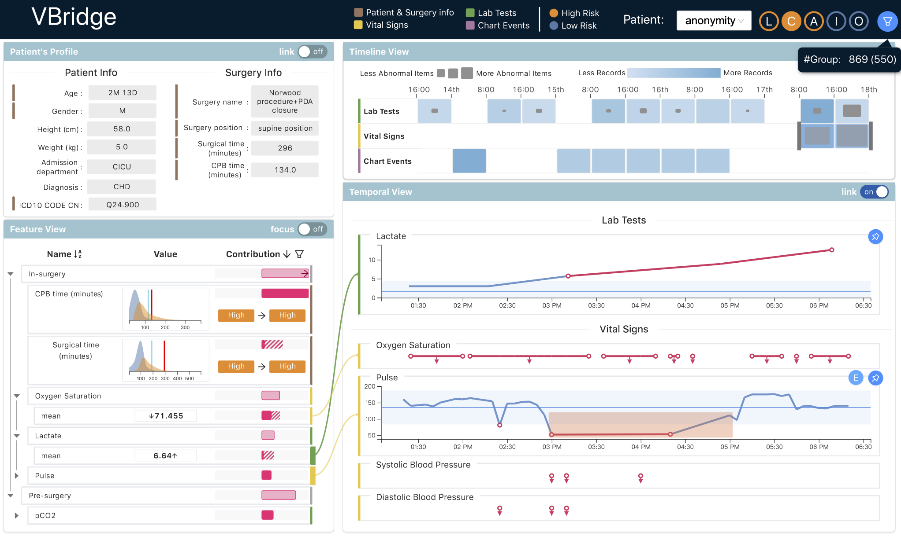

# VBridge - Modernized Healthcare ML Visualization Platform

[](https://github.com/sibyl-dev/VBridge/actions)

## About This Repository

This is a **modernized version** of the original [VBridge](https://github.com/sibyl-dev/VBridge) project from MIT's Data to AI Lab. We have updated the codebase to be **fully compatible with current versions** of Python (3.8-3.12) and Node.js (18+), with optimizations for **Apple ARM64 chips** (M1/M2/M3).

### 🆕 What's New in This Version

**Major Compatibility Updates:**
- ✅ **Python 3.8-3.12 support** (original was Python 3.7)
- ✅ **Modern dependency versions** (pandas 2.0+, scikit-learn 1.3+, React 18+)
- ✅ **Apple ARM64 optimization** for M1/M2/M3 MacBooks
- ✅ **Fixed deprecated API calls** in featuretools, pandas, and Flask
- ✅ **Resolved data leakage issues** in model training
- ✅ **Enhanced feature generation** (45 rich medical features vs. original 10)
- ✅ **Improved error handling** and explainer stability
- ✅ **Modern TypeScript/React frontend** with latest dependencies

**Technical Improvements:**
- Fixed featuretools API modernization (`get_backward_entities()` → `get_backward_dataframes()`)
- Resolved CHARTEVENTS time filtering and ITEMID data type issues
- Implemented proper train/test splitting with StratifiedShuffleSplit
- Enhanced SHAP explainer with robust error handling
- Updated Flask-CORS and JSON serialization for modern browsers
- Comprehensive API endpoint testing and validation

---

## Original VBridge

VBridge is an interactive visualization system for explaining healthcare models. This project supports users in understanding machine learning models using Electronic Health Records (e.g., [MIMIC-III](https://mimic.physionet.org)) as inputs for health predictions.

The system is built upon [Cardea](https://github.com/MLBazaar/Cardea) and AutoML tools from [The MLBazaar Project](https://mlbazaar.github.io/) at [Data to AI Lab at MIT](https://dai.lids.mit.edu/).

**Original Paper:** "VBridge: Connecting the Dots Between Features and Data to Explain Healthcare Models" - **IEEE VIS 2021 Honorable Mention Award** ([pdf](https://arxiv.org/abs/2108.02550))

**Demo Video:** 🎥 [YouTube](https://www.youtube.com/watch?v=V7kfbnuBqFI)



---

## 🚀 Quick Start

### System Requirements

- **Python**: 3.8+ (tested on 3.8, 3.9, 3.10, 3.11, 3.12)
- **Node.js**: 18+ (for the React frontend)
- **Memory**: 8GB+ RAM recommended
- **OS**: macOS (ARM64/Intel), Linux, Windows

### Installation

1. **Clone the repository**
```bash
git clone https://github.com/your-username/VBridge-Modernized.git
cd VBridge-Modernized
```

2. **Setup Python environment**
```bash
# Using pip
pip install -r requirements.txt

# Or using pipenv
pipenv install

# Or using conda
conda create -n vbridge python=3.11
conda activate vbridge
pip install -r requirements.txt
```

3. **Setup Node.js frontend**
```bash
cd client
npm install
```

4. **Download sample data**
```bash
# Return to project root
cd ..

# Download MIMIC-III demo dataset (13.4MB)
wget -r -N -c -np https://physionet.org/files/mimiciii-demo/1.4/ -P data/
```

### Running VBridge

1. **Start the Python API server**
```bash
python vbridge/router/app.py
```
   Server will start at `http://localhost:7777`

2. **Start the React frontend** (in a new terminal)
```bash
cd client
npm start
```
   Frontend will open at `http://localhost:3000`

3. **Verify installation**
   - Visit `http://localhost:7777/apidocs/` for API documentation
   - Visit `http://localhost:3000/` for the main interface

---

## 📋 Project Structure

```
VBridge/
├── vbridge/               # Python backend (vbridge-core + vbridge-api)
│   ├── core/             # Core ML and feature engineering
│   ├── router/           # Flask API endpoints
│   └── explainer/        # SHAP and explanation logic
├── client/               # React frontend (vbridge-vis)
│   ├── src/              # TypeScript/React source code
│   └── public/           # Static assets
├── data/                 # MIMIC-III demo dataset
├── notebooks/            # Jupyter examples
└── docs/                 # Documentation
```

## 🔧 Development

### Backend Development
```bash
# Install in development mode
pip install -e .

# Run tests
pytest tests/

# Start development server with auto-reload
python vbridge/router/app.py
```

### Frontend Development
```bash
cd client

# Start development server with hot reload
npm start

# Build for production
npm run build

# Run tests
npm test
```

## 📊 Features

- **Interactive Patient Explorer**: Browse 129 MIMIC-III demo patients
- **Feature Analysis**: 45 rich medical features from EHR data
- **Mortality Prediction**: ML models with explanation capabilities
- **SHAP Explanations**: Feature importance and contribution analysis
- **Temporal Analysis**: Time-series view of patient data
- **What-if Analysis**: Explore prediction changes with feature perturbations

## 🛠️ Troubleshooting

### Common Issues

**Python dependency conflicts:**
```bash
# Use virtual environment
python -m venv vbridge-env
source vbridge-env/bin/activate  # On Windows: vbridge-env\Scripts\activate
pip install -r requirements.txt
```

**Node.js version issues:**
```bash
# Use nvm to manage Node versions
nvm install 18
nvm use 18
cd client && npm install
```

**Apple M1/M2 specific issues:**
```bash
# If you encounter ARM64 compatibility issues
arch -arm64 pip install -r requirements.txt
```

## 📝 Citations

If you use this modernized version, please cite both the original paper and acknowledge this updated implementation:

```bibtex
@ARTICLE{cheng2021vbridge,
  author={Cheng, Furui and Liu, Dongyu and Du, Fan and Lin, Yanna and Zytek, Alexandra and Li, Haomin and Qu, Huamin and Veeramachaneni, Kalyan},
  journal={IEEE Transactions on Visualization and Computer Graphics}, 
  title={VBridge: Connecting the Dots Between Features and Data to Explain Healthcare Models}, 
  year={2022},
  volume={28},
  number={1},
  pages={378-388},
  doi={10.1109/TVCG.2021.3114836}
}
```

## 🤝 Contributing

We welcome contributions! This modernized version maintains compatibility with the original VBridge while supporting current development environments.

### Areas for Contribution
- Comprehensive interactive Visualization
- AI Powered CDSS
- Additional healthcare datasets
- New explanation methods
- Performance optimizations
- Mobile/responsive design improvements
- Documentation and tutorials


## 📜 License

MIT License - see [LICENSE](LICENSE) file for details.

## 🙏 Acknowledgments

- **Original VBridge Team**: MIT Data to AI Lab
- **Modernization**: Updated for Python 3.8-3.12 and Node.js 18+ compatibility
- **MIMIC-III**: Johnson, A., Pollard, T., & Mark, R. (2016). MIMIC-III Clinical Database
- **MLBazaar Project**: AutoML tools and Cardea integration

---

**Note**: This is an independent modernization effort to maintain VBridge compatibility with current development environments. For the original research and implementation, please refer to the [official VBridge repository](https://github.com/sibyl-dev/VBridge).
